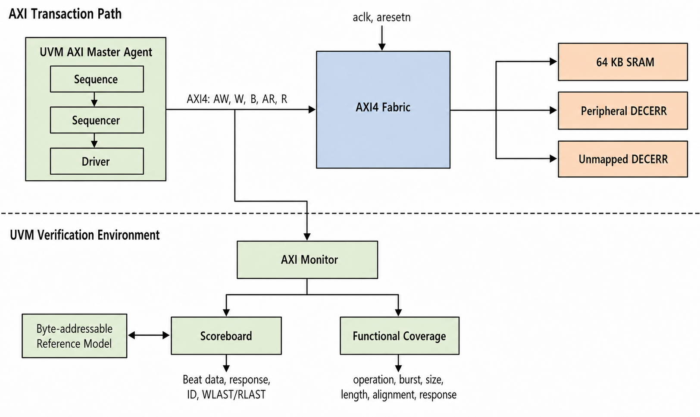

# AXI4 SoC UVM Verification

## Overview

This project verifies AXI4 INCR burst transfers through a simple AXI fabric.
The fabric routes transactions to a 64 KB SRAM or to DECERR responders for
unsupported address regions.

The bus uses 32-bit addresses, 32-bit data, and 4-bit transaction IDs.

## Key Features

- AXI4 INCR bursts from 1 to 16 beats
- Byte, halfword, and word transfers
- Independent write address and write data channels
- Byte-enable handling with `WSTRB`
- `WLAST`, `RLAST`, `BID`, and `RID` checks
- UVM driver, monitor, sequencer, scoreboard, and coverage collector
- Byte-addressable reference memory
- Directed and constrained-random tests
- Functional coverage with six crosses

## Architecture



The master agent drives the AXI channels through the fabric. The monitor sends
completed transactions to the scoreboard and coverage collector. The
scoreboard uses a byte-addressable reference model for read-data checking.

## Memory Map

| Region | Address |
| --- | --- |
| SRAM | `0x0000_0000` - `0x0000_FFFF` |
| Peripheral placeholder | `0x1000_0000` - `0x1000_0FFF` |
| Unmapped addresses | DECERR response |

## Files

- `axi-4_soc_top.sv` - AXI interface, fabric, SRAM, error responders, and RTL top (`soc_top`)
- `tb_axi-4_soc.sv` - UVM environment, agents, scoreboards, tests, and testbench top (`tb_top`)
- `images/axi4-uvm-block-diagram.png` - Project block diagram

## Tests

| Test | Description |
| --- | --- |
| `smoke_test` | Four single-beat write/read pairs |
| `incr_burst_4_test` | Four-beat INCR burst |
| `incr_burst_8_test` | Eight-beat INCR burst |
| `incr_burst_16_test` | Sixteen-beat INCR burst |
| `incr_byte_burst_test` | Byte transfers |
| `incr_halfword_burst_test` | Halfword transfers |
| `incr_word_burst_test` | Word transfers |
| `random_incr_test` | Random aligned write/read burst pairs |

## Running on EDA Playground

Select Cadence Xcelium 25.03, SystemVerilog, and UVM 1.2.

Place the combined RTL in `design.sv` and the combined UVM testbench in
`testbench.sv`.

Smoke test options:

```text
-access +rw -coverage all +UVM_TESTNAME=smoke_test
```

Random test options:

```text
-access +rw -coverage all +UVM_TESTNAME=random_incr_test +RANDOM_PAIRS=100
```

## Results

The directed tests and random seeds 1, 7, 42, 99, and 1234 passed with no UVM
errors, fatals, or scoreboard mismatches.

The 100-pair Xcelium run checked 574 write beats and 574 read beats. Functional
coverage was 58.33% for the INCR-only test set.

FIXED bursts, WRAP bursts, unaligned traffic, and multiple outstanding
transactions are reserved for future work.
